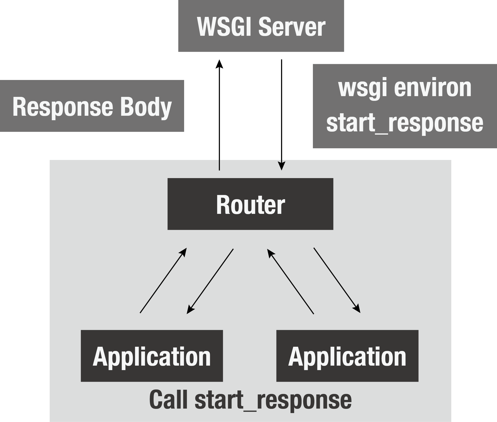

ルーティング
======

シンプルなルーティング
-----------

前章では、WSGIの仕様について確認し、それを満たす小さなアプリケーションをつくりました。
ここからは実際にWebフレームワークを作っていきましょう。

先程のアプリケーションでは、URLのパス情報によらず全て「Hello World」と返しています。
実際のアプリケーションでは、沢山のページが存在するためパス情報に応じてそれぞれ違ったレスポンスを返す必要があります。
簡単なルーティング方法として次のような方法があるでしょう。

.. code-block:: python

    def application(env, start_response):
        path = env['PATH_INFO']
        if path == '/':
            start_response('200 OK', [('Content-type', 'text/plain')])
            return [b'Hello World']
        elif path == '/foo':
            start_response('200 OK', [('Content-type', 'text/plain')])
            return [b'foo']
        else:
            start_response('404 Not Found', [('Content-type', 'text/plain')])
            return [b'404 Not Found']

WSGIのアプリケーションの第一引数には、辞書型オブジェクトが渡されています。
ここではWebブラウザなどのクライアントから送られたリクエストの情報などが入っています。
リクエストのパス情報もその一つで、 `PATH_INFO` により取り出す事ができます。

URL変数と正規表現によるルーティング
-------------------

URL変数
~~~~~

もう少し複雑なケースを考えてみましょう。
こちらのBottleのアプリケーションの一部を見てください。

.. code-block:: python

   @route('/hello/<name>')
   def greet(name='Stranger'):
       return template('Hello {{name}}, how are you?', name=name)

   @route('/users/<user_id:int>')
   def user_detail(user_id):
       users = ['user{id}'.format(id=i) for i in range(10)]
       return template('Hello {{user}}', user=users[user_id])

`/hello/foo` と `/hello/bar` はそれぞれ別のエンドポイントですが、上のコードではどちらも `greet` 関数が呼ばれます。
またURLのパス情報から `foo` や `bar` などの変数(以下、URL変数)を取り出しています。

先程のようにif文で分岐させていくのは大変なので、別の方法を考えてみましょう。
解決策の一つとして正規表現の利用があります。

正規表現モジュール
~~~~~~~~~

`正規表現 <http://docs.python.jp/3/library/re.html>`_ は普段使わない方も多いかと思います。
ここで簡単におさらいしましょう。

.. code-block:: python

   >>> import re
   >>> url_scheme = '/users/(?P<user_id>\d+)/'
   >>> re.match('/users/(?P<user_id>\d+)/', '/users/1/').groupdict()
   {'user_id': '1'}

   >>> pattern = re.compile(url_scheme)
   >>> pattern.match('/users/1/').groupdict()
   {'user_id': '1'}

このように名前付きグループでパターンを定義し、マッチするか確認してからgroupdictを呼ぶことでuser_idの部分の数字が文字列で取得出来ます。

構成図
~~~~

それでは、ルーティング機能を提供するため、フレームワークの実装を始めましょう。
ここで提供するルーティングは次のようなイメージです。

   ルーティングのイメージ。
   パス情報にあわせて別のアプリケーションを呼び出す。

それでは図のRouterを実装していきましょう。
フレームワークの利用者からは、次のような形で利用出来るようにしてみます。

.. code-block:: python

   from myframework import App

   app = App()

   @app.route('^/users/$')
   def user_list(env, start_response):
       start_response('200 OK', [('Content-type', 'text/plain; charset=utf-8')])
       return [b'User List']

   @app.route('^/users/(?P<user_id>\d+)/$')
   def user_detail(env, start_response, user_id):
       start_response('200 OK', [('Content-type', 'text/plain; charset=utf-8')])
       res = 'Hello user {user_id}'.format(user_id=user_id)
       return [res.encode('utf-8')]

   if __name__ == '__main__':
       from wsgiref.simple_server import make_server
       httpd = make_server('', 8000, app)
       httpd.serve_forever()

Routerクラス
---------

Routerクラスを用意します。

1. add メソッドにより、各ルートの情報を辞書型オブジェクトのリストに格納する
2. matchするか調べる

.. code-block:: python

   import re

   def http404(env, start_response):
       start_response('404 Not Found', [('Content-type', 'text/plain; charset=utf-8')])
       return [b'404 Not Found']

   class Router:
       def __init__(self):
           self.routes = []

       def add(self, method, path, callback):
           self.routes.append({
               'method': method,
               'path': path,
               'callback': callback
           })

       def match(self, method, path):
           for r in filter(lambda x: x['method'] == method.lower(), self.routes):
               matched = re.compile(r['path']).match(path)
            if matched:
                kwargs = matched.groupdict()
                return r, kwargs
        return http404, {}

試しに動作確認

.. code-block:: python

   >>> from routes import Router
   >>> router = Router()
   >>> def users():
   ...     return 'user list'
   >>> def create_user():
   ...     return 'create user'
   >>> def user_detail(id):
   ...     return 'user{id} detail'.format(id)
   >>> router.add('get', '^/users/$', users)
   >>> router.add('post', '^/users/$', create_user)
   >>> router.add('get', '^/users/(?P<user_id>\d+)/$', user_detail)
   >>> callback, kwargs = router.match('get', '/users/')
   >>> callback(**kwargs)
   'user list'
   >>> route, kwargs = router.match('post', '/users/')
   >>> callback(**kwargs)
   'create user'
   >>> route, kwargs = router.match('get', '/users/1/')
   >>> callback(**kwargs)
   'user1 detail'

うまく機能していますね。

Routerを組み込んだWSGIのアプリケーション用クラスを作る
--------------------------------

.. literalinclude:: _codes/routing/app.py

動作確認
----

動かしてみましょう

.. literalinclude:: _codes/routing/main.py

.. todo:: Reverse routingについて

.. 逆引き(Reversing)に対応する
.. -------------------
..
.. 逆引きに対応しましょう。
.. 正規表現ベースのルーティングはその自由度の高さと引き換えに、逆引きが困難になっています。
.. 今回は正規表現ではなく、次のような形式で記述してみましょう。
..
.. .. code-block:: python
..
..    @app.route('/users/{id})
..    def user_detail(id: int):
..        return 'Hello user{id}'.format(id=id)
..
.. `/users/{id}` の形式であれば逆引きは以下のように簡単に出来ます.

.. .. code-block:: python
..
..    >>> url = '/users/{id}/'
..    >>> url.format(id=1)
..    '/users/1/'

.. formatメソッドにより逆引きが非常に容易になりました

.. 正引きの方法
.. ~~~~~~
..
.. 整備機は少し複雑です。
..
.. 1. '/users/{id}/' を '/' で分割.
.. 2. requestのpath情報も同じように '/' で分割し、長さを比較
..     - 一致すれば次に進む
..     - 一致しなければ、このURLではないと判断
.. 3. 前から順番に文字列を比較.
..     - '{' で開始して '}' で終了するときは、TypeHintsの情報にキャストできるかどうかチェック
.. 4. 全て一致する、もしくはキャスト可能であればOK

.. todo:: traversal routingについて書く

.. TraversalとURL Dispatch
.. ----------------------
..
.. これまで説明してきた方法は、URL Dispatchとよばれるものです。
.. 各URLのパターンをリストのように持ち、一致するかどうかそれぞれチェックしていました。
.. 他の方法として親子関係によりURLの構造を表現するTravarsalと呼ばれるものがあります。
.. URL Dispatchの方が比較的よく利用されますが、Pyramidはどちらも指定できるようになっています。
..
.. 興味のある方は下記の記事を読んでみてください
..
.. http://docs.pylonsproject.org/projects/pyramid/en/latest/narr/hybrid.html
