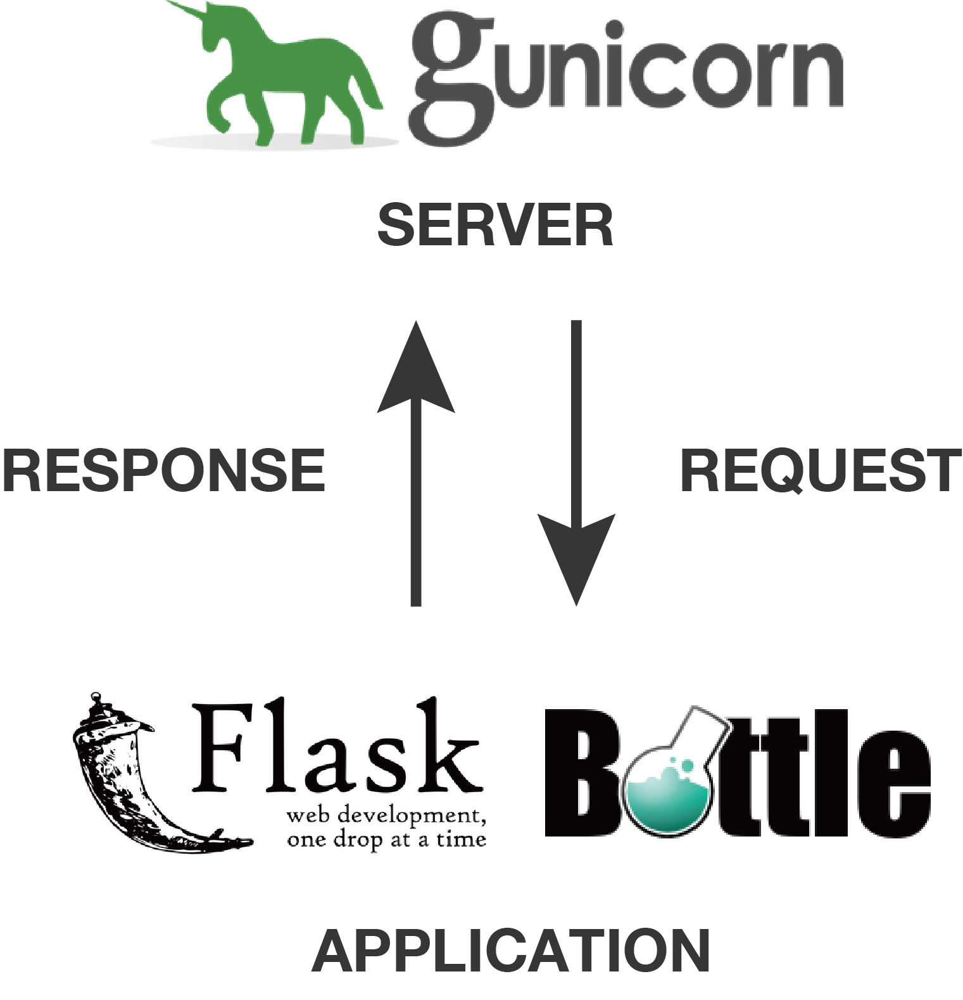
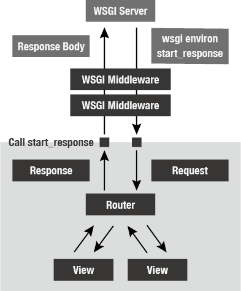

WSGI について
=========

アプリケーション・サーバ間のやりとり
------------------

FlaskやDjangoで書かれたアプリケーションを動かすときは、当然ですがサーバーが必要になります。
本番環境で動かすときには gunicorn や uWSGI が広く利用されます。

.. note::

   実はPythonの標準ライブラリの中にも ``wsgiref`` というサーバー実装が存在します。
   シングルスレッドでしか動作しないなど性能面の問題はありますが、標準ライブラリに含まれていて別途インストールする必要はないため、
   開発環境ではこちらが使われることも多くあります。
   例えばFlaskクラスが提供する ``run()`` メソッドや、Djangoの ``manage.py runserver`` はデフォルトで wsgiref を利用します。

Webアプリを開発する際には、これらのサーバ上で作成したアプリケーションを動かしますが、
具体的にWebサーバと私達の開発しているアプリケーションがどのようなやりとりを行っているのか、日頃の開発の中で意識することは少ないのではないでしょうか。
しかし、Webフレームワークを開発するとなるとどのようにやり取りが行われているのかを知っておく必要があります。

   サーバとアプリケーションの間では何かしらのやり取りが行われています。

PythonではアプリケーションとWebサーバのインタフェースとして `PEP3333 <https://www.python.org/dev/peps/pep-3333/>`_ で定義された
WSGI(Web Server Gateway Interface)という仕様が広く利用されています。
DjangoやFlask、Bottle、Pyramid などの有名なPythonのWebフレームワークはどれもWSGIの仕様に準拠しています。
ここでは私達も WSGI の仕様に準拠したアプリケーションフレームワークを開発していきます。
こうすることで gunicorn や uWSGI などの優れた既存のWSGIサーバーを利用できます。

.. note::

   `PEP3333 <https://www.python.org/dev/peps/pep-3333/>`_ で定義されているはWSGIのversionは v1.0.1 ですが、
   PEPではその前のバージョンとして `PEP333 (WSGI v1.0) <http://www.python.org/dev/peps/pep-0333/>`_ も存在します。
   PEP333 はPython 2を前提としていましたが、Python3から文字列の扱いが大きく変化したためそれに合わせてアップデートされ、
   その他の細かい仕様変更が PEP3333 には加わっています。

WSGI (Web Server Gateway Interface)
-----------------------------------

それではWSGIの仕様について勉強していきましょう。
PEP3333 を全て読むのは大変なので、実際のPythonのコードをベースに概要だけ理解していきましょう。

.. code-block:: python

   def application(env, start_response)
       start_response('200 OK', [('Content-type', 'text/plain; charset=utf-8')])
       return [b'Hello World']

このたった3行のPythonのコードはWSGIの仕様を満たしています。
それではどのような仕様だったのでしょうか？行ごとに説明していきます。

1. WSGIのアプリケーションは、2つの引数を持った呼び出し可能なオブジェクトである
2. 第2引数として渡されたオブジェクトを呼び出し、HTTPステータスコードとヘッダ情報を渡す
3. レスポンスボディとしてバイト文字列をyieldするiterableなオブジェクトを返す。

いかがでしょうか。とてもシンプルなインタフェースです。
たった3行のコードですが、本当にWSGIの仕様を満たしているのであれば、gunicornやuWSGIといった
おなじみのWSGIサーバで動かすことができるはずですね。
実際に動かしてみましょう。
上のコードを `hello.py` という名前で保存し、下記のコマンドを実行してください。

.. code-block:: console

   $ pip install gunicorn
   $ gunicorn -w 1 hello:application

.. figure:: _static/gunicorn-wsgi.gif
   :width: 600px
   :align: center
   :alt: 3行のコードをgunicornで動かしてみる

   3行のコードをgunicornで動かしてみる

動きましたか？正常に動作した場合はWebブラウザなどでアクセスすると、上のGIFアニメーションのように `Hello World` と表示されるはずです。
それでは次の章でこれから作るWebフレームワークに必要な機能を考えていきましょう。

フレームワークに求められる機能とは？
------------------

Hello Worldを表示するだけの簡単なアプリケーションであれば、フレームワークを使わずに実装することが出来ました。
それではこれからWebアプリケーションを開発する上で、Webフレームワークがどのような機能を提供すると楽になるでしょうか。
Webアプリケーションの開発経験がある方なら、このあたりは容易に想像がつくでしょう。
例として次のような機能があると開発が楽になりそうです。

ルーティング
~~~~~~

先ほどのHello WorldのアプリケーションはどこにアクセスしてもHello Worldが返ってきます。
実際のWebサイトにはたくさんのページが存在し、URLやHTTPメソッドに応じてサーバー側の処理が異なります。

リクエストオブジェクト・レスポンスオブジェクト
~~~~~~~~~~~~~~~~~~~~~~~

リクエスト情報は、WSGIアプリケーションの第一引数として提供されますが、こちらは辞書型のオブジェクトです。
ここから直接、GETのクエリパラメータやその他のリクエスト情報を取り出すのは大変なため、
それらの情報をうまくラップしてくれるクラスがあるといいでしょう。
またレスポンスのヘッダ情報やステータス情報もうまく管理してくれるクラスがあるとよさそうです。

HTMLテンプレート
~~~~~~~~~~

HTMLを表示する際に、Pythonの変数を評価して埋め込めると便利です。
BottleやDjangoのように、自前でテンプレートエンジンを用意してもいいかもしれませんが、Jinja2などすでに
広く利用されているテンプレートエンジンのローダがあると便利かもしれません。
今回は一から実装はせずに、Jinja2のテンプレートエンジンのローダを用意します。

静的ファイルの配信
~~~~~~~~~

CSSやJS、画像ファイルなどの静的ファイルは、本番環境の場合、 Nginx 等で返す場合が多いかもしれません。
しかし開発中や手元のパソコンでも Nginx の設定をして静的ファイルを返すように設定するのは面倒なので、
フレームワークにも静的ファイルを返す機能があると開発が捗りそうです。

今回作成するWebフレームワーク
----------------

使い方
~~~~~~

この資料で作成するフレームワークを使うと次のようにコードを記述出来ます。
FlaskやBottleでの開発に慣れた方であれば、簡単に扱えることができるのではないでしょうか。

.. code-block:: python

   from app import App, Response, JSONResponse
   from wsgiref.simple_server import make_server

   app = App()

   @app.route('^/$')
   def index(request):
       return Response('Hello World')

   @app.route('^/users/(?P<user_id>\d+)/$')
   def user_detail(request, user_id):
       data = {'user': user_id}
       return JSONResponse(data, indent=4)

   if __name__ == '__main__':
       httpd = make_server('', 8000, app)
       httpd.serve_forever()

全体像
~~~~~~

今の時点で理解できている必要はありませんが、フレームワークの全体像も載せておきます。

   フレームワークの全体像

Router や Request 、 Response クラスを1つずつ実装していけば、徐々に上の図に書かれているフレームワークに近づいていきます。
この資料を読み終えるころにはBottleやFlaskのようなフレームワークがどのように構成されているのかコンセプトも含めてイメージできるようになるでしょう。

まとめ
----

この章ではWSGIの概要について解説しました。
またWSGIの提供するインターフェイスでは足りない機能を解説し、これからつくるWebフレームワークの完成形について紹介しました。
ここからは一緒にWSGIのアプリケーションフレームワークを作っていきましょう。
