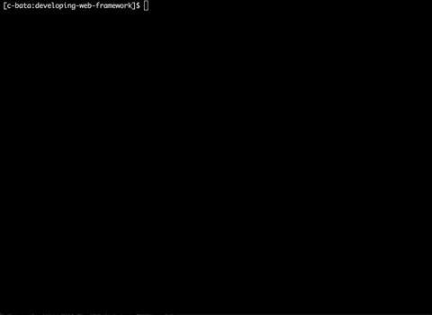

WSGI について
=========

アプリケーション・サーバ間のやりとり
------------------

PythonではWebサーバとしてgunicornやuWSGIが広く利用されています。
Webアプリを開発する際には、これらのサーバ上で作成したアプリケーションを動かしますが、
具体的にWebサーバと私達の開発しているアプリケーションがどのようなやりとりを行っているのか、日頃の開発の中で意識することは少ないでしょう。
しかし、Webフレームワークを開発するとなるとどのようにやり取りが行われているのかを知っておく必要があります。

.. figure:: _static/something-server-interface.png
   :width: 300px
   :align: center
   :alt: サーバ・アプリケーション間のやりとり

   サーバとアプリケーションの間では何かしらのやり取りが行われています。

PythonではアプリケーションとWebサーバのインタフェースとして `PEP3333 <https://www.python.org/dev/peps/pep-3333/>`_ で定義された
WSGI(Web Server Gateway Interface)という仕様が広く利用されています。

それではWSGIについて勉強していきましょう。

.. note::

   `PEP3333 <https://www.python.org/dev/peps/pep-3333/>`_ で定義されているはWSGIのversionは v1.0.1 ですが、
   PEPではその前のバージョンとして `PEP333 (WSGI v1.0) <http://www.python.org/dev/peps/pep-0333/>`_ も存在します。

WSGI (Web Server Gateway Interface)
-----------------------------------

WSGIの仕様を全て読むのは大変なので、実際のPythonのコードをベースに概要だけ理解していきましょう。

.. code-block:: python

   def application(env, start_response)
       start_response('200 OK', [('Content-type', 'text/plain; charset=utf-8')])
       return [b'Hello World']

この3行のPythonのコードはWSGIの仕様を満たしています。
それではどのような仕様だったのでしょうか？各行ごとの説明は次のとおりです。

1. WSGIのアプリケーションは、2つの引数を持った呼び出し可能なオブジェクトである
2. 第2引数として渡されたオブジェクトを呼び出し、HTTPステータスコードとヘッダ情報を渡す
3. レスポンスボディとしてバイト文字列をyieldするiterableなオブジェクトを返す

いかがでしょうか。とてもシンプルなインタフェースです。
たった3行のコードですが、本当にWSGIの仕様を満たしているのであれば、gunicornやuWSGIといった
おなじみのWSGIサーバで動かすことができるはずですね。
実際に動かしてみましょう。
上のコードを `hello.py` という名前で保存し、下記のコマンドを実行してください。

.. code-block:: sh

   $ pip install gunicorn
   $ gunicorn -w 1 hello:application

   3行のコードをgunicornで動かしてみる

動きましたか？正常に動作した場合はWebブラウザなどでアクセスすると、上のGIFアニメーションのように `Hello World` と表示されるはずです。
それでは次の章でこれから作るWebフレームワークに必要な機能を考えていきましょう。

.. note::

   Pythonの標準モジュールの中にも、WSGIのリファレンス実装があります。
   シングルスレッドでしか動作しないなど、機能的には gunicorn 等に劣りますが、
   標準モジュールに含まれているため、開発やデバッグ等に活用すると便利です。

   .. literalinclude:: _codes/helloworld.py

まとめ
----

この章ではWSGIの概要について解説しました。
ここからは一緒にWSGIのアプリケーションフレームワークを作っていきましょう。
WSGIの仕様に従ったアプリケーションを実装することにより、Webサーバを実装する必要はありません。

それでは次の章ではWSGIのアプリケーションフレームワークとして、どのような機能が必要なのか考えていきましょう。
