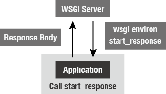

name: inverse
layout: true
class: center, middle, inverse
---
# 基礎から学ぶWebアプリケーションフレームワークの作り方

Masashi Shibata (@c\_bata\_)

PyConJP 2016

2016/09/21 (Wed)

.footnote[Go directly to [github](https://github.com/c-bata/WebFramework-in-Python)]

---
layout: false
.left-column[
## About Me
]

.right-column[
.pull-container[
.float-left[ ]
]

- 芝田 将 (Masashi Shibata)
- twitter: `@c\_bata\_` github: `@c-bata`
- 明石高専 専攻科
- PyCon JP 2015, 2016 スタッフ
- PyCon Taiwan 2015, JP 2015, Korea 2016 でLT
    - http://gihyo.jp/news/report/01/pycon-apac-2015
    - http://gihyo.jp/news/report/01/pycon-apac2016

念願のトークセッション :)
]


???
これまでPyConにはTaiwan, JP, Koreaと3回参加してきたのですが、全部Lightning Talkをやっていまして、今回は念願の一般トークです。
聞きに来てくださってありがとうございます。みなさんにはWebフレームワークのコードを読む自信を持ち帰ってもらいたいなと思います。

ジョブズはiPhoneの発表日に、 This is the day (この日を待ってたんだ)って言ったらしい。
意気込みを伝えたい。堂々としたい。価値を届けるんだっていいたい


---
# 動機と目的

何か躓いた時に、自分で修正したい。そもそもバグなのか調べたい。

???
- 何かOSSのライブラリとかのコードを読んで勉強してみたいなと思った
- 自分はWebのサーバサイドエンジニアを目指してる学生なので、一番良く使っているのは FlaskやDjango だろう
- これからサーバサイドをメインに頑張っていくのなら、ただフレームワークを使えるのではなくて実装まで意識できる。何か困ったことがあれば自分で直せるエンジニアになりたかった
- でもシンプルで読みやすいと言われていたBottleのコードも全く読めない。何から手を付ければいいのか分からなかった。

---
# みなさんに持ち帰って欲しい内容

- Webフレームワークの構成要素とそれぞれの目的をしっかり覚えて帰ってください。
    - あとはコードを読んで理解できるはずです。
- 細かい部分は、Youtube, Sphinxで復習してください。
- それが終わったらBottleかKobinの実装を読んでみてください
    - Kobinはversionを3.5に絞っていて、Type Hintsもあり読みやすいと思います :)

???
最終的に出来上がるアプリケーションは150行ほどです。
かなり短い方ですが、話を聞きながら細かい実装まで全てをこのセッション中に全員が理解するのは難しいかと思います。

やっぱり自分の聞きたいのと違ったなって思った方は、今からまだ他のセッションに移っていただいても大丈夫です。
全員移っちゃうと悲しいから、1人ぐらいは残って聞いてくださいね。


---
# コードを読んでみよう

自分が分かってないところを整理。


???

- Bottleのコードを読み始めた。
- 全く分からない


---
# サーバとの通信

- gunicornとかuWSGIで動かす
- そういうサーバとはどうやって通信するんだろう？
    - 何か共通のインタフェースがあるはず

???


---
template: inverse

# WSGIについて

---
.left-column[
## WSGI
### What's WSGI
]
.right-column[
PEP 3333で策定された、サーバとアプリケーションの標準化インタフェース


1. 2つの引数を持った呼び出し可能なオブジェクト
2. 第2引数として渡されたオブジェクトを呼び出し、HTTPステータスコードとヘッダ情報を渡す
3. レスポンスボディとしてバイト文字列をyieldするiterableなオブジェクトを返す
]

---
.left-column[
## WSGI
### What's WSGI
### Flow
]
.right-column[
## WSGIの流れ


]

---
.left-column[
## WSGI
### What's WSGI
### Flow
### Minimum Application
]
.right-column[
```python
def application(env, start_response):
    start_response('200 OK', [('Content-type', 'text/plain; charset=utf-8')])
    return [b'Hello World']
```
]

---
.left-column[
## WSGI
### What's WSGI
### Flow
### Minimum Application
### Running with gunicorn
]
.right-column[

```bash
$ gunicorn -w 1 hello:app
```
]

???
本当にさっきの3行のアプリケーションが動いた :)
これを拡張していけばよさそうだ。
何をどう拡張しよう。


---
template: inverse

# ルーティング

---
# 拡張をするまえに

関数のままでは機能追加が難しそうだ :(

```python
from flask import Flask

app = Flask(__name__)
:
```

???
そういえば形式が違う。
オブジェクトを


---
# `__call__` メソッド

関数のままでは機能追加が難しそうだ :(

```python
class App:
    def __call__(self, env, start_response):
        start_response('200 OK', [('Content-type', 'text/plain')])
        return [b'Hello World']
```

???
これの紹介は、RouteクラスとRouterクラスを実装したあとに、Appに組み込む時にしたほうが流れとして自然。

---
# ルーティング

```python
app = App()

@app.route('^/users/$')
def users(env, start_response):
    start_response('200 OK', [('Content-type', 'text/plain')])
    return 
```

???

今のアプリケーションはどこにいっても


---
template: inverse

# リクエストクラス

---
.left-column[
## Request
]

.right-column[
全部に、envとstart_responseを渡すのは面倒そうだ
]

---
.left-column[
## Request
### Request Body
]
.right-column[
リクエストボディを取得する

```python
@property
def body(self):
    if self._body is None:
        content_length = int(self.environ.get('CONTENT_LENGTH', 0))
        self._body = self.environ['wsgi.input'].read(content_length)
    return self._body

@property
def text(self, charset='utf-8'):
    return self.body.decode(charset)
```

]

---
.left-column[
## Request
### Request Body
### Query Parameters
]
.right-column[
GETのクエリパラメータを取得

`application/x-www-form-urlencoded` 型のデータに対しては、 `urllib.parse.parse_qs` を利用する

```python
>>> from urllib.parse import parse_qs
>>> parse_qs('foo=bar&hoge=fuga')
{'hoge': ['fuga'], 'foo': ['bar']}
```
]

---
.left-column[
## Request
### Request Body
### Query Parameters
### Form Parameters
]
.right-column[
POSTのクエリパラメータを取得

`cgi.FieldStorage` を利用する

```python
@property
def forms(self):
    form = cgi.FieldStorage(
        fp=self.environ['wsgi.input'],
        environ=self.environ,
        keep_blank_values=True,
    )
    params = {k: form[k].value for k in form}
    return params
```

]

---
template: inverse

# レスポンスクラス

---
.left-column[
## Response
]
.right-column[
- ヘッダ
- ステータス
- ボディ
]


---
.left-column[
## Response
### Headers
]
.right-column[
ヘッダ

```python
>>> from wsgiref.headers import Headers
>>> h = Headers()
>>> h.add_header('Content-type', 'text/plain')
>>> h.add_header('Foo', 'bar')
>>> h.items()
[('Content-type', 'text/plain'), ('Foo', 'bar')]
```
]

---
template: inverse

# ミドルウェア

???
ミドルウェアとは

---
.left-column[
## Middleware
]
.right-column[
図を挿入
]

---
.left-column[
## Middleware
### Router
]
.right-column[
実はすでに作っていた
]

---
.left-column[
## Middleware
### Router
### Static files
]
.right-column[
CSSやJS、画像などの静的ファイルは...
]

---
# Webフレームワークの作り方

Pythonの具体的なコードをベースにWebアプリケーションフレームワークを作る上で必要となる知識について解説します。
Hello Worldをスタートとして、ルーティングやリクエスト・レスポンスのハンドリング方法、CSSやJS等の静的ファイルの扱いなどWebアプリケーションフレームワークに必要な機能とその実装方法を解説します。


---
# Kobinの紹介

私が開発しているKobinというフレームワークと、それを用いた実際のアプリケーションを紹介します。
Kobinは本発表で紹介した機能を全て実装していますが、その実装は800行に満たない程度(5/17現在)と非常に短く、勉強用途としては最適なWebフレームワークとなっています。
またType Hintsを活用しているためコードを読む上での手がかりとなる情報も既存のフレームワークに比べ多いでしょう。


---
# まとめ


