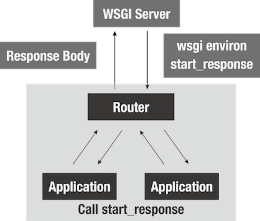
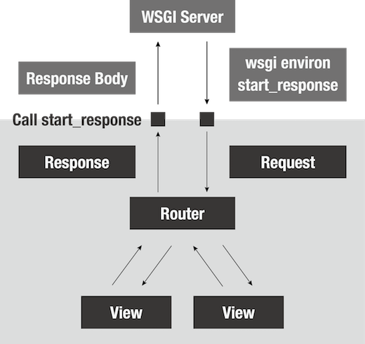

name: inverse
layout: true
class: center, middle, inverse
---
<!-- ================================================================== -->
<!-- ========================== 目次 =================================== -->
<!-- ================================================================== -->
# 基礎から学ぶ Webアプリケーションフレームワークの作り方

Masashi Shibata (@c\_bata\_)

PyConJP 2016

2016/09/21 (Wed)

.footnote[Go directly to [Github](https://github.com/c-bata/WebFramework-in-Python)]

---
layout: false
.left-column[
## Profile
.center[.profileicon[]]
]

.right-column[
こんにちは！

- 芝田 将 (Masashi Shibata)
- twitter: @c\_bata\_
- github: @c-bata
- 明石高専 専攻科
- PyCon JP 2015, 2016 スタッフ
- PyCon Taiwan 2015, JP 2015, Korea 2016 でLT
    - http://gihyo.jp/news/report/01/pycon-apac-2015
    - http://gihyo.jp/news/report/01/pycon-apac2016

念願のトークセッション :)
]


???
これまでPyConにはTaiwan, JP, Koreaと3回参加してきたのですが、全部Lightning Talkをやっていまして、今回は念願の一般トークです。
聞きに来てくださってありがとうございます。みなさんにはWebフレームワークのコードを読む自信を持ち帰ってもらいたいなと思います。

ジョブズはiPhoneの発表日に、 This is the day (この日を待ってたんだ)って言ったらしい。
意気込みを伝えたい。堂々としたい。価値を届けるんだっていいたい

今日の発表資料の方はtwitterに流しています。

<!-- ================================================================== -->
<!-- ========================== はじめに =============================== -->
<!-- ================================================================== -->
---
.left-column[
## はじめに
### きっかけ
]
.right-column[
- 何か躓いた時に、自分で修正したい。そもそもバグなのか調べたい。
]

???
- 何かOSSのライブラリとかのコードを読んで勉強してみたいなと思った
- 自分はWebのサーバサイドエンジニアを目指してる学生なので、一番良く使っているのは FlaskやDjango だろう
- これからサーバサイドをメインに頑張っていくのなら、ただフレームワークを使えるのではなくて実装まで意識できる。何か困ったことがあれば自分で直せるエンジニアになりたかった
- でもシンプルで読みやすいと言われていたBottleのコードも全く読めない。何から手を付ければいいのか分からなかった。

---
.left-column[
## はじめに
### きっかけ
### ゴール
]
.right-column[
- Webフレームワークの構成要素とそれぞれの目的をしっかり覚えて帰ってください。
    - あとはコードを読んで理解できるはずです。
- 細かい部分は、Youtube, Sphinxで復習してください。
- それが終わったらBottleかKobinの実装を読んでみてください
    - Kobinはversionを3.5に絞っていて、Type Hintsもあり読みやすいと思います :)
]

???
持ち帰って欲しい内容
最終的に出来上がるアプリケーションは150行ほどです。
かなり短い方ですが、話を聞きながら細かい実装まで全てをこのセッション中に全員が理解するのは難しいかと思います。

やっぱり自分の聞きたいのと違ったなって思った方は、今からまだ他のセッションに移っていただいても大丈夫です。
全員移っちゃうと悲しいから、1人ぐらいは残って聞いてくださいね。

<!-- ================================================================== -->
<!-- ============================= WSGI =============================== -->
<!-- ================================================================== -->
---
.image-center[

]

???
まずWebアプリケーションを開発したことのある方はこの中にも多くいらっしゃると思うんですが、
WebアプリケーションっていうのはWebサーバからclientからのrequestを受け取ってそれをうまく処理してかえしていくという流れになっているかと思います。
みなさんもFlaskやDjangoを使ってWebアプリケーションを開発するときには、gunicornやuWSGIといったサーバで動かしてますよね。

---
.image-center[

]

???
具体的にWebサーバと私達の開発しているアプリケーションがどのようなやりとりを行っているのか、日頃の開発の中で意識することは少ないでしょう。
しかし、Webフレームワークを開発するとなるとどのようにやり取りが行われているのかを知っておく必要があります。

---
template: inverse

# WSGI

Web Server Gateway Interface

---
.left-column[
## WSGI
### What's WSGI
]
.right-column[
**WSGI 【Web Server Gateway Interface】**

PEP 3333にて策定された、サーバとアプリケーションの標準化インタフェース
]

???
PythonではWeb Server Gateway Interface略してWSGIと読むんですけど、
これに従ってアプリケーションを作りましょうねっていうのがPython Enhancement Proposalの3333として定義されました。
じゃあこれについて解説していきます

---
.left-column[
## WSGI
### What's WSGI
### Specification
]
.right-column[
**WSGI 【Web Server Gateway Interface】**

1. 2つの引数を持った呼び出し可能なオブジェクト
2. 第2引数として渡されたオブジェクトを呼び出し、HTTPステータスコードとヘッダ情報を渡す
3. レスポンスボディとしてバイト文字列をyieldするiterableなオブジェクトを返す
]

---
.left-column[
## WSGI
### What's WSGI
### Minimum Application
]
.right-column[
### 3 lines of Python
```python
def application(env, start_response):
    start_response('200 OK', [('Content-type', 'text/plain; charset=utf-8')])
    return [b'Hello World']
```
]

???
1行ずつ解説していきます

---
.left-column[
## WSGI
### What's WSGI
### Minimum Application
]
.right-column[
### 3 lines of Python
```python
def application(env, start_response):
    start_response('200 OK', [('Content-type', 'text/plain; charset=utf-8')])
    return [b'Hello World']
```

1. 2つの引数を持った呼び出し可能なオブジェクト
]

---
.left-column[
## WSGI
### What's WSGI
### Minimum Application
]
.right-column[
### 3 lines of Python
```python
def application(env, start_response):
    start_response('200 OK', [('Content-type', 'text/plain; charset=utf-8')])
    return [b'Hello World']
```

1. 2つの引数を持った呼び出し可能なオブジェクト
2. 第2引数として渡されたオブジェクトを呼び出し、HTTPステータスコードとヘッダ情報を渡す
]

---
.left-column[
## WSGI
### What's WSGI
### Minimum Application
]
.right-column[
### 3 lines of Python
```python
def application(env, start_response):
    start_response('200 OK', [('Content-type', 'text/plain; charset=utf-8')])
    return [b'Hello World']
```

1. 2つの引数を持った呼び出し可能なオブジェクト
2. 第2引数として渡されたオブジェクトを呼び出し、HTTPステータスコードとヘッダ情報を渡す
3. レスポンスボディとしてバイト文字列をyieldするiterableなオブジェクトを返す
]

---
.left-column[
## WSGI
### What's WSGI
### Minimum Application
### Running with gunicorn
]
.right-column[
WSGIサーバであれば動かせるはず！

```bash
$ gunicorn -w 1 hello:app
```


]

???
本当にさっきの3行のアプリケーションが動いた :)
これを拡張していけばよさそうだ。
何をどう拡張しよう。


<!-- ================================================================== -->
<!-- ========================== ルーティング ============================ -->
<!-- ================================================================== -->
---
template: inverse

# ルーティング

---
.left-column[
## Routing
### Basic Routing
]
.right-column[
最もシンプルなルーティング

```python
def application(env, start_response):
    path = env['PATH_INFO']
    if path == '/':
        start_response('200 OK', [('Content-type', 'text/plain')])
        return [b'Hello World']
    elif path == '/foo':
        start_response('200 OK', [('Content-type', 'text/plain')])
        return [b'foo']
    else:
        start_response('404 Not Found', [('Content-type', 'text/plain')])
        return [b'404 Not Found']
```

`env` はリクエスト情報が入った辞書型オブジェクト.

リクエストのパスは、 `env['PATH_INFO']` から取得
]

???
先程のアプリケーションでは、URLのパス情報によらず全て「Hello World」と返しています。
実際のアプリケーションでは、沢山のページが存在するためパス情報に応じてそれぞれ違ったレスポンスを返す必要があります。
簡単なルーティング方法はこのような感じになるかと思います。

WSGIのアプリケーションの第一引数には、辞書型オブジェクトが渡されています。
ここではWebブラウザなどのクライアントから送られたリクエストの情報などが入っています。
リクエストのパス情報もその一つで、 PATH_INFO により取り出す事ができます。

---
.left-column[
## Routing
### Basic Routing
### URL Variables
]
.right-column[
**URL変数**

Bottleの例:

```python
@route('/hello/<name>')
def greet(name='Stranger'):
    return template('Hello {{name}}, how are you?', name=name)

@route('/users/<user_id:int>')
def user_detail(user_id):
    users = ['user{id}'.format(id=i) for i in range(10)]
    return template('Hello {{user}}', user=users[user_id])
```

URLのパス情報から変数として取り出したりもしたい
]

???
/hello/foo と /hello/bar はそれぞれ別のエンドポイントですが、上のコードではどちらも greet 関数が呼ばれます。
またURLのパス情報から foo や bar などの変数(以下、URL変数)を取り出しています。
先程のようにif文で分岐させていくのは大変なので、別の方法を考えてみましょう。

---
.left-column[
## Routing
### Basic Routing
### URL Variables
### Regex Module
]
.right-column[
Pythonの正規表現モジュールについておさらい

```python
>>> import re
>>> url_scheme = '/users/(?P<user_id>\d+)/'
>>> re.match('/users/(?P<user_id>\d+)/', '/users/1/').groupdict()
{'user_id': '1'}

>>> pattern = re.compile(url_scheme)
>>> pattern.match('/users/1/').groupdict()
{'user_id': '1'}
```
]

???
正規表現 は普段使わない方も多いかと思います。 ここで簡単におさらいしましょう。
このように名前付きグループでパターンを定義し、マッチするか確認してからgroupdictを呼ぶことでuser_idの部分の数字が文字列で取得出来ます。

---
.left-column[
## Routing
### Basic Routing
### URL Variables
### Regex Module
### Structure
]
.right-column[
ルータの構造


]

???
それでは、ルーティング機能を提供するため、フレームワークの実装を始めましょう。 ここで提供するルーティングは次のようなイメージです。

---
.left-column[
## Routing
### Basic Routing
### URL Variables
### Regex Module
### Structure
### Code
]
.right-column[
```python
import re


def http404(env, start_response):
    start_response('404 Not Found', [('Content-type', 'text/plain; charset=utf-8')])
    return [b'404 Not Found']


class Router:
    def __init__(self):
        self.routes = []

    def add(self, method, path, callback):
        self.routes.append({
            'method': method,
            'path': path,
            'callback': callback
        })

    def match(self, method, path):
        for r in filter(lambda x: x['method'] == method.upper(), self.routes):
            matched = re.compile(r['path']).match(path)
            if matched:
                kwargs = matched.groupdict()
                return r['callback'], kwargs
        return http404, {}
```
]

???
ここは解説してコピペしてPyCharmに貼り付け
次にiPython開いてこれの動作を確認(ライブコーディング)

or

コピペしてPyCharmに貼り付け
PyCharmのデバッガで逐次実行しながら、説明 (これだと値を見ながら説明出来る。Request, Responseオブジェクトも実際の値を使って説明出来る)

---
.left-column[
## Routing
### Basic Routing
### URL Variables
### Regex Module
### Structure
### Code
]
.right-column[
Routerクラスを組み込む。

関数のままでは機能追加が難しそうだ :(

WSGIのアプリケーション用のクラスを用意する。

```python
class App:
    def __call__(self, env, start_response):
        start_response('200 OK', [('Content-type', 'text/plain')])
        return [b'Hello World']
```

`__call__` メソッドを定義すると、Appクラスのオブジェクトが呼び出し可能(callable)になる。
]

???
これの紹介は、RouteクラスとRouterクラスを実装したあとに、Appに組み込む時にしたほうが流れとして自然。

そういえば形式が違う。
オブジェクトを


---
.left-column[
## Routing
### Basic Routing
### URL Variables
### Regex Module
### Structure
### Code
]

.right-column[
アプリケーションに組み込む

```python
class App:
    def __init__(self):
        self.router = Router()

    def route(self, path=None, method='GET', callback=None):
        def decorator(callback_func):
            self.router.add(method, path, callback_func)
            return callback_func
        return decorator(callback) if callback else decorator

    def __call__(self, env, start_response):
        method = env['REQUEST_METHOD'].upper()
        path = env['PATH_INFO'] or '/'
        callback, kwargs = self.router.match(method, path)
        return callback(env, start_response, **kwargs)
```
]

---
.left-column[
## Routing
### Basic Routing
### URL Variables
### Regex Module
### Structure
### Code
]
.right-column[
動かしてみましょう。

```python
from app import App
from wsgiref.simple_server import make_server


app = App()


@app.route('^/$', 'GET')
def hello(env, start_response):
    start_response('200 OK', [('Content-type', 'text/plain; charset=utf-8')])
    return [b'Hello World']


@app.route('^/user/(?P<name>\w+)$', 'GET')
def user_detail(env, start_response, name):
    start_response('200 OK', [('Content-type', 'text/plain; charset=utf-8')])
    body = 'Hello {name}'.format(name=name)
    return [body.encode('utf-8')]


if __name__ == '__main__':
    httpd = make_server('', 8000, app)
    httpd.serve_forever()
```
]

<!-- ================================================================== -->
<!-- =========================== リクエスト ============================ -->
<!-- ================================================================== -->
---
template: inverse

# リクエストクラス

---
.left-column[
## Request
### Structure
]

.right-column[
全部に、envとstart_responseを渡すのは面倒そうだ


WSGIのEnvironmentではなく、うまくラップしたクラスを返したい。
]

---
.left-column[
## Request
### Structure
### Request Class
]
.right-column[
リクエストボディを取得する

```python
class Request:
    def __init__(self, environ):
        self.environ = environ
        self._body = None

    @property
    def body(self) -> str:
        if self._body is None:
            content_length = int(self.environ.get('CONTENT_LENGTH', 0))
            self._body = self.environ['wsgi.input'].read(content_length).decode('utf-8')
        return self._body

    @property
    def text(self, charset='utf-8'):
        return self.body.decode(charset)
```
]

---
.left-column[
## Request
### Structure
### Request Body
### Query Parameters
]
.right-column[
GETのクエリパラメータを取得

`application/x-www-form-urlencoded` 型のデータに対しては、 `urllib.parse.parse_qs` を利用する

```python
>>> from urllib.parse import parse_qs
>>> parse_qs('foo=bar&hoge=fuga')
{'hoge': ['fuga'], 'foo': ['bar']}
```
]

---
.left-column[
## Request
### Structure
### Request Body
### Query Parameters
### Form Parameters
]
.right-column[
POSTのクエリパラメータを取得

`cgi.FieldStorage` を利用する

```python
@property
def forms(self):
    form = cgi.FieldStorage(
        fp=self.environ['wsgi.input'],
        environ=self.environ,
        keep_blank_values=True,
    )
    params = {k: form[k].value for k in form}
    return params
```

]

<!-- ================================================================== -->
<!-- ============================ レスポンス ============================ -->
<!-- ================================================================== -->
---
template: inverse

# レスポンスクラス

---
.left-column[
## Response
### Structure
]
.right-column[

]

???
- ヘッダ
- ステータス
- ボディ

---
.left-column[
## Response
### Structure
### Headers
]
.right-column[
ヘッダ

```python
>>> from wsgiref.headers import Headers
>>> h = Headers()
>>> h.add_header('Content-type', 'text/plain')
>>> h.add_header('Foo', 'bar')
>>> h.items()
[('Content-type', 'text/plain'), ('Foo', 'bar')]
```
]

<!-- ================================================================== -->
<!-- ========================== ミドルウェア ============================ -->
<!-- ================================================================== -->
---
template: inverse

# ミドルウェア

???
ミドルウェアとは

---
.left-column[
## Middleware
### Structure
]
.right-column[

]

---
.left-column[
## Middleware
### Structure
### Router
]
.right-column[
実はすでに作っていた


]

---
.left-column[
## Middleware
### Router
### Static files
]
.right-column[
CSSやJS、画像などの静的ファイルは...
]

<!-- ================================================================== -->
<!-- ========================== Kobinの紹介 ============================ -->
<!-- ================================================================== -->
---
template: inverse

# Kobin

---
.left-column[
## Kobin
### About
]
.right-column[
私が開発しているKobinというフレームワークと、それを用いた実際のアプリケーションを紹介します。
Kobinは本発表で紹介した機能を全て実装していますが、その実装は800行に満たない程度(5/17現在)と非常に短く、勉強用途としては最適なWebフレームワークとなっています。
またType Hintsを活用しているためコードを読む上での手がかりとなる情報も既存のフレームワークに比べ多いでしょう。
]

.left-column[
## Kobin
### About
### Usage
]
.right-column[
**使い方**

```python
from kobin import Kobin
app = Kobin()

@app.route('/')
def hello() -> str:
    return "Hello World"

@app.route('/users/{user_id}')
def hello(user_id: int) -> str:
    return "Hello {}!!".format(user_id)

if __name__ == '__main__':
    app.run()
```
]

---
.left-column[
## Kobin
### About
### Usage
### ToDo
]
.right-column[
Kobinのサンプルアプリケーション


]


---
# 帰ってからやってほしいこと

コードを読む！
