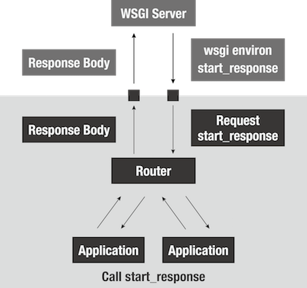
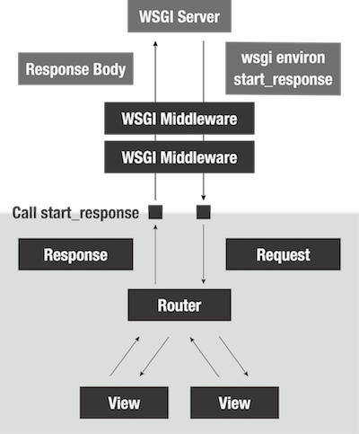

name: inverse
layout: true
class: center, middle, inverse
---
<!-- ================================================================== -->
<!-- ========================== 目次 =================================== -->
<!-- ================================================================== -->
# 基礎から学ぶ Webアプリケーションフレームワークの作り方

Masashi Shibata (@c\_bata\_)

PyConJP 2016

2016/09/21 (Wed)

<a href="http://b.hatena.ne.jp/entry/c-bata.link/webframework-in-python/slide.html%231" class="hatena-bookmark-button" data-hatena-bookmark-layout="basic-label-counter" data-hatena-bookmark-lang="ja" title="このエントリーをはてなブックマークに追加"></a>

.footnote[Go directly to [Github](https://github.com/c-bata/webframework-in-python)]

---
layout: false
.left-column[
## Profile
.center[.profileicon[]]
]

.right-column[
こんにちは！

- 芝田 将 (Masashi Shibata)
- twitter: @c\_bata\_
- 明石高専 専攻科
- PyCon JP 2015, 2016 スタッフ
- PyCon Taiwan 2015, JP 2015, Korea 2016 でLT
    - http://gihyo.jp/news/report/01/pycon-apac-2015
    - http://gihyo.jp/news/report/01/pycon-apac2016

念願のトークセッション :)
]


???
これまでPyConにはTaiwan, JP, Koreaと3回参加してきたのですが、全部Lightning Talkをやっていまして、今回は念願の一般トークです。
聞きに来てくださってありがとうございます。みなさんにはWebフレームワークのコードを読む自信を持ち帰ってもらいたいなと思います。

今日の発表資料の方はtwitterに流しています。

<!-- ================================================================== -->
<!-- ========================== はじめに =============================== -->
<!-- ================================================================== -->
---
.left-column[
## Intro
### Motivation
]
.right-column[
これまでの悩み

- 今作りたいアプリケーションには、どのフレームワークが向いている？
- この機能を使ってみたいけどドキュメントがよく分からない
- こういうことって出来るのかな？
- 意図してる挙動と違うような気がするけど、どうしよう
]

???
- 何かOSSのライブラリとかのコードを読んで勉強してみたいなと思った
- 自分はWebのサーバサイドエンジニアを目指してる学生なので、一番良く使っているのは FlaskやDjango だろう
- これからサーバサイドをメインに頑張っていくのなら、ただフレームワークを使えるのではなくて実装まで意識できる。何か困ったことがあれば自分で直せるエンジニアになりたかった
- でもシンプルで読みやすいと言われていたBottleのコードも全く読めない。何から手を付ければいいのか分からなかった。

---
.left-column[
## Intro
### Motivation
### Goal
]
.right-column[
**対象読者:**

- FlaskやDjangoなどを使ったWebアプリケーション開発経験のある方

**ゴール:**

- WEBフレームワークを読むきっかけに！
- コードは公開しているので、後からでも追いかけられます
    - http://c-bata.link/webframework-in-python/
    - コードはメモしなくてもOKです
- 他のフレームワークを読むきっかけに(Kobin, Bottle)
]

???
持ち帰って欲しい内容
最終的に出来上がるアプリケーションは150行ほどです。
かなり短い方ですが、話を聞きながら細かい実装まで全てをこのセッション中に全員が理解するのは難しいかと思います。


---
.left-column[
## Intro
### Motivation
### Goal
### WAF
]
.right-column[
これから作るWebフレームワーク

```python
from app import App, Response, TemplateResponse, JSONResponse
from wsgiref.simple_server import make_server


app = App()


@app.route('^/$', 'GET')
def hello(request):
    return Response('Hello World')


@app.route('^/user/$', 'POST')
def create_user(request):
    return JSONResponse({'message': 'User Created'}, status='201 Created')


@app.route('^/user/(?P<name>\w+)$', 'GET')
def user_detail(request, name):
    return Response('Hello {name}'.format(name=name))

if __name__ == '__main__':
    httpd = make_server('', 8000, app)
    httpd.serve_forever()
```
]

???
最終的に出来上がるアプリケーションは150行ほどです。

- デコレータベースでView関数に対して、URLやHTTPメソッドを割り当て
- このフレームワークにおけるView関数は、Requestと呼ばれるオブジェクトとURL変数を受け取る
- View関数はResponseクラスを返す


<!-- ================================================================== -->
<!-- ============================= WSGI =============================== -->
<!-- ================================================================== -->
---
.image-center[

]

???
まずWebアプリケーションを開発したことのある方はこの中にも多くいらっしゃると思うんですが、
WebアプリケーションっていうのはWebサーバからclientからのrequestを受け取ってそれをうまく処理してかえしていくという流れになっているかと思います。
みなさんもFlaskやDjangoを使ってWebアプリケーションを開発するときには、gunicornやuWSGIといったサーバで動かしてますよね。

---
.image-center[

]

???
具体的にWebサーバと私達の開発しているアプリケーションがどのようなやりとりを行っているのか、日頃の開発の中で意識することは少ないでしょう。
しかし、Webフレームワークを開発するとなるとどのようにやり取りが行われているのかを知っておく必要があります。

---
template: inverse

# WSGI

Web Server Gateway Interface

---
.left-column[
## WSGI
### What's WSGI
]
.right-column[
**WSGI 【Web Server Gateway Interface】**

- 読み：「ウィズギー」
- PEP 3333にて v1.0.1 が策定
- サーバとアプリケーションの標準化インタフェース
- Webサーバとアプリケーションの組み合わせを柔軟に
    - この仕様に従えば自分たちでサーバの実装は不要
]

???
PythonではWeb Server Gateway Interface略してWSGIと読むんですけど、
これに従ってアプリケーションを作りましょうねっていうのがPython Enhancement Proposalの3333として定義されました。
じゃあこれについて解説していきます

---
.left-column[
## WSGI
### What's WSGI
### Minimum Application
]
.right-column[
### 3 lines of Python

PEP3333を読んでいくのは大変なのでコードで解説

```python
def application(env, start_response):
    start_response('200 OK', [('Content-type', 'text/plain; charset=utf-8')])
    return [b'Hello World']
```
]

???
1行ずつ解説していきます

---
.left-column[
## WSGI
### What's WSGI
### Minimum Application
]
.right-column[
### 3 lines of Python

PEP3333を読んでいくのは大変なのでコードで解説

```python
def application(env, start_response):
    start_response('200 OK', [('Content-type', 'text/plain; charset=utf-8')])
    return [b'Hello World']
```

1. 2つの引数を持った呼び出し可能なオブジェクト
]

---
.left-column[
## WSGI
### What's WSGI
### Minimum Application
]
.right-column[
### 3 lines of Python

PEP3333を読んでいくのは大変なのでコードで解説


```python
def application(env, start_response):
    start_response('200 OK', [('Content-type', 'text/plain; charset=utf-8')])
    return [b'Hello World']
```

1. 2つの引数を持った呼び出し可能なオブジェクト
2. 第2引数として渡されたオブジェクトを呼び出し、HTTPステータスコードとヘッダ情報を渡す
]

---
.left-column[
## WSGI
### What's WSGI
### Minimum Application
]
.right-column[
### 3 lines of Python

PEP3333を読んでいくのは大変なのでコードで解説

```python
def application(env, start_response):
    start_response('200 OK', [('Content-type', 'text/plain; charset=utf-8')])
    return [b'Hello World']
```

1. 2つの引数を持った呼び出し可能なオブジェクト
2. 第2引数として渡されたオブジェクトを呼び出し、HTTPステータスコードとヘッダ情報を渡す
3. レスポンスボディとしてバイト文字列をyieldするiterableなオブジェクトを返す
]

---
.left-column[
## WSGI
### What's WSGI
### Minimum Application
### Running with gunicorn
]
.right-column[
WSGIサーバであれば動かせるはず！

```bash
$ gunicorn -w 1 hello:app
```


]

???
本当にさっきの3行のアプリケーションが動いた :)
これを拡張していけばよさそうだ。
何をどう拡張しよう。


<!-- ================================================================== -->
<!-- ========================== ルーティング ============================ -->
<!-- ================================================================== -->
---
template: inverse

# ルーティング

---
.left-column[
## Routing
### Basic Routing
]
.right-column[
最もシンプルなルーティング

```python
def application(env, start_response):
    path = env['PATH_INFO']
    if path == '/':
        start_response('200 OK', [('Content-type', 'text/plain')])
        return [b'Hello World']
    elif path == '/foo':
        start_response('200 OK', [('Content-type', 'text/plain')])
        return [b'foo']
    else:
        start_response('404 Not Found', [('Content-type', 'text/plain')])
        return [b'404 Not Found']
```

`env` はリクエスト情報が入った辞書型オブジェクト.

リクエストのパスは、 `env['PATH_INFO']` から取得
]

???
先程のアプリケーションでは、URLのパス情報によらず全て「Hello World」と返しています。
実際のアプリケーションでは、沢山のページが存在するためパス情報に応じてそれぞれ違ったレスポンスを返す必要があります。
簡単なルーティング方法はこのような感じになるかと思います。

WSGIのアプリケーションの第一引数には、辞書型オブジェクトが渡されています。
ここではWebブラウザなどのクライアントから送られたリクエストの情報などが入っています。
リクエストのパス情報もその一つで、 PATH_INFO により取り出す事ができます。

---
.left-column[
## Routing
### Basic Routing
### URL Variables
]
.right-column[
**URL変数**

Bottleの例:

```python
@route('/hello/<name>')
def greet(name='Stranger'):
    return template('Hello {{name}}, how are you?', name=name)

@route('/users/<user_id:int>')
def user_detail(user_id):
    users = ['user{id}'.format(id=i) for i in range(10)]
    return template('Hello {{user}}', user=users[user_id])
```

URLのパス情報から変数として取り出したりもしたい
]

???
/hello/foo と /hello/bar はそれぞれ別のエンドポイントですが、上のコードではどちらも greet 関数が呼ばれます。
またURLのパス情報から foo や bar などの変数(以下、URL変数)を取り出しています。
先程のようにif文で分岐させていくのは大変なので、別の方法を考えてみましょう。

---
.left-column[
## Routing
### Basic Routing
### URL Variables
### Regex Module
]
.right-column[
Pythonの正規表現モジュールについておさらい

```python
>>> import re
>>> url_scheme = '/users/(?P<user_id>\d+)/'
>>> re.match('/users/(?P<user_id>\d+)/', '/users/1/').groupdict()
{'user_id': '1'}

>>> pattern = re.compile(url_scheme)
>>> pattern.match('/users/1/').groupdict()
{'user_id': '1'}
```
]

???
正規表現 は普段使わない方も多いかと思います。 ここで簡単におさらいしましょう。
このように名前付きグループでパターンを定義し、マッチするか確認してからgroupdictを呼ぶことでuser_idの部分の数字が文字列で取得出来ます。

---
.left-column[
## Routing
### Basic Routing
### URL Variables
### Regex Module
### Structure
]
.right-column[
ルータの構造


]

???
それでは、ルーティング機能を提供するため、フレームワークの実装を始めましょう。 ここで提供するルーティングは次のようなイメージです。

---
.left-column[
## Routing
### Basic Routing
### URL Variables
### Regex Module
### Structure
### Code
]
.right-column[
```python
import re


def http404(env, start_response):
    start_response('404 Not Found', [('Content-type', 'text/plain; charset=utf-8')])
    return [b'404 Not Found']


class Router:
    def __init__(self):
        self.routes = []

    def add(self, method, path, callback):
        self.routes.append({
            'method': method,
            'path': path,
            'callback': callback
        })

    def match(self, method, path):
        for r in filter(lambda x: x['method'] == method.upper(), self.routes):
            matched = re.compile(r['path']).match(path)
            if matched:
                kwargs = matched.groupdict()
                return r['callback'], kwargs
        return http404, {}
```
]

???
ここは解説してコピペしてPyCharmに貼り付け
次にiPython開いてこれの動作を確認(ライブコーディング)

or

コピペしてPyCharmに貼り付け
PyCharmのデバッガで逐次実行しながら、説明 (これだと値を見ながら説明出来る。Request, Responseオブジェクトも実際の値を使って説明出来る)

---
.left-column[
## Routing
### Basic Routing
### URL Variables
### Regex Module
### Structure
### Code
]
.right-column[
Routerクラスを組み込む。

関数のままでは機能追加が難しそうだ :(

WSGIのアプリケーション用のクラスを用意する。

```python
class App:
    def __call__(self, env, start_response):
        start_response('200 OK', [('Content-type', 'text/plain')])
        return [b'Hello World']
```

`__call__` メソッドを定義すると、Appクラスのオブジェクトが呼び出し可能(callable)になる。
]

???
これの紹介は、RouteクラスとRouterクラスを実装したあとに、Appに組み込む時にしたほうが流れとして自然。

そういえば形式が違う。
オブジェクトを


---
.left-column[
## Routing
### Basic Routing
### URL Variables
### Regex Module
### Structure
### Code
]

.right-column[
アプリケーションに組み込む

```python
class App:
    def __init__(self):
        self.router = Router()

    def route(self, path=None, method='GET', callback=None):
        def decorator(callback_func):
            self.router.add(method, path, callback_func)
            return callback_func
        return decorator(callback) if callback else decorator

    def __call__(self, env, start_response):
        method = env['REQUEST_METHOD'].upper()
        path = env['PATH_INFO'] or '/'
        callback, kwargs = self.router.match(method, path)
        return callback(env, start_response, **kwargs)
```
]

---
.left-column[
## Routing
### Basic Routing
### URL Variables
### Regex Module
### Structure
### Code
]
.right-column[
動かしてみましょう。

```python
from app import App
from wsgiref.simple_server import make_server


app = App()


@app.route('^/$', 'GET')
def hello(env, start_response):
    start_response('200 OK', [('Content-type', 'text/plain; charset=utf-8')])
    return [b'Hello World']


@app.route('^/user/(?P<name>\w+)$', 'GET')
def user_detail(env, start_response, name):
    start_response('200 OK', [('Content-type', 'text/plain; charset=utf-8')])
    body = 'Hello {name}'.format(name=name)
    return [body.encode('utf-8')]


if __name__ == '__main__':
    httpd = make_server('', 8000, app)
    httpd.serve_forever()
```
]

<!-- ================================================================== -->
<!-- =========================== リクエスト ============================ -->
<!-- ================================================================== -->
---
template: inverse

# リクエストクラス

---
.left-column[
## Request
### Structure
]

.right-column[
全部に、envとstart_responseを渡すのは面倒そうだ



WSGIのEnvironmentではなく、うまくラップしたクラスを返したい。
]

---
.left-column[
## Request
### Structure
### Request Class
]
.right-column[
リクエストボディを取得する

```python
import json


class Request:
    def __init__(self, environ, charset='utf-8'):
        self.environ = environ
        self._body = None
        self.charset = charset

    @property
    def body(self):
        if self._body is None:
            content_length = int(self.environ.get('CONTENT_LENGTH', 0))
            self._body = self.environ['wsgi.input'].read(content_length)
        return self._body

    @property
    def text(self):
        return self.body.decode(self.charset)

    @property
    def json(self):
        return json.loads(self.body)
```
]

---
.left-column[
## Request
### Structure
### Request Body
### Query Parameters
]
.right-column[
GETのクエリパラメータを取得

`application/x-www-form-urlencoded` 型のデータに対しては、 `urllib.parse.parse_qs` を利用する

```python
>>> from urllib.parse import parse_qs
>>> parse_qs('foo=bar&hoge=fuga')
{'hoge': ['fuga'], 'foo': ['bar']}
```
]

---
.left-column[
## Request
### Structure
### Request Body
### Query Parameters
### Form Parameters
]
.right-column[
POSTのクエリパラメータを取得

`cgi.FieldStorage` を利用する

```python
@property
def forms(self):
    form = cgi.FieldStorage(
        fp=self.environ['wsgi.input'],
        environ=self.environ,
        keep_blank_values=True,
    )
    params = {k: form[k].value for k in form}
    return params
```
]


---
.left-column[
## Request
### Structure
### Request Body
### Query Parameters
### Form Parameters
### Request Class
]
.right-column[
```python
class Request:
    (中略)

    @property
    def forms(self):
        form = cgi.FieldStorage(
            fp=self.environ['wsgi.input'],
            environ=self.environ,
            keep_blank_values=True,
        )
        params = {k: form[k].value for k in form}
        return params

    @property
    def query(self):
        return parse_qs(self.environ['QUERY_STRING'])
```
]


---
.left-column[
## Request
### Structure
### Request Body
### Query Parameters
### Form Parameters
### Request Class
### Code
]
.right-column[
アプリケーションに組み込む
```python
class App:
    def __init__(self):
        self.router = Router()

    def route(self, path=None, method='GET', callback=None):
        def decorator(callback_func):
            self.router.add(method, path, callback_func)
            return callback_func
        return decorator(callback) if callback else decorator

    def __call__(self, env, start_response):
        method = env['REQUEST_METHOD'].upper()
        path = env['PATH_INFO'] or '/'
        callback, kwargs = self.router.match(method, path)
        return callback(Request(env), start_response, **kwargs)
```
]

---
.left-column[
## Request
### Structure
### Request Body
### Query Parameters
### Form Parameters
### Request Class
### Code
]
.right-column[
アプリケーションに組み込む
```python
@app.route('^/$', 'GET')
def hello(request, start_response):
    start_response('200 OK', [('Content-type', 'text/plain; charset=utf-8')])
    return [b'Hello World']


@app.route('^/user/$', 'POST')
def create_user(request, start_response):
    start_response('201 Created', [('Content-type', 'text/plain; charset=utf-8')])
    return [b'User Created']


@app.route('^/user/(?P<name>\w+)$', 'GET')
def user_detail(request, start_response, name):
    start_response('200 OK', [('Content-type', 'text/plain; charset=utf-8')])
    body = 'Hello {name}'.format(name=name)
    return [body.encode('utf-8')]
```

デバッガで見てみよう

```bash
$ curl http://127.0.0.1:8000/?name=foo
$ curl -X POST -d '{"name": "foo"}' http://127.0.0.1:8000/
```
]

<!-- ================================================================== -->
<!-- ============================ レスポンス ============================ -->
<!-- ================================================================== -->
---
template: inverse

# レスポンスクラス

---
.left-column[
## Response
### Structure
]
.right-column[
レスポンス情報もうまくラップしてあげたい。


]

???
- ヘッダ
- ステータス
- ボディ

---
.left-column[
## Response
### Structure
### Headers
]
.right-column[
標準で組み込まれている、 `wsgiref` モジュールにはWSGIのフレームワークを作る上で便利な機能もあり。

```python
>>> from wsgiref.headers import Headers
>>> h = Headers()
>>> h.add_header('Content-type', 'text/plain')
>>> h.add_header('Foo', 'bar')
>>> h.items()
[('Content-type', 'text/plain'), ('Foo', 'bar')]
```

ヘッダのコントロールには `wsgiref.headers.Headers` を活用
]

---
.left-column[
## Response
### Structure
### Headers
### Response Class
]
.right-column[

```python
from wsgiref.headers import Headers

class Response:
    default_status = '200 OK'
    default_content_type = 'text/plain; charset=UTF-8'

    def __init__(self, body='', status=None, headers=None):
        self._body = body
        self.status = status or self.default_status
        self.headers = Headers()

        if headers:
            for name, value in headers.items():
                self.headers.add_header(name, value)

    @property
    def body(self):
        if isinstance(self._body, str):
            return self._body.encode('utf-8')
        return self._body

    @property
    def header_list(self):
        if 'Content-Type' not in self.headers:
            self.headers.add_header('Content-Type', self.default_content_type)
        return self.headers.items()
```
]

???
* デフォルトのステータスは `200 OK`
* Content-Type: `text/plain`
* charset: `UTF-8`

---
.left-column[
## Response
### Structure
### Headers
### Response Class
### Code
]
.right-column[
アプリケーションに組み込む

```python
def http404(request):
    return Response('404 Not Found', status='404 Not Found')


class App:
    def __init__(self):
        self.router = Router()

    def route(self, path=None, method='GET', callback=None):
        def decorator(callback_func):
            self.router.add(method, path, callback_func)
            return callback_func
        return decorator(callback) if callback else decorator

    def __call__(self, env, start_response):
        method = env['REQUEST_METHOD'].upper()
        path = env['PATH_INFO'] or '/'
        callback, kwargs = self.router.match(method, path)

        response = callback(Request(env), **kwargs)
        start_response(response.status, response.header_list)
        return [response.body]
```
]

---
.left-column[
## Response
### Structure
### Headers
### Response Class
### Code
]
.right-column[
アプリケーションに組み込む

```python
from app import App, Response

(中略)

@app.route('^/$', 'GET')
def hello(request):
    return Response('Hello World')


@app.route('^/user/$', 'POST')
def create_user(request):
    response = Response('User Created', status='201 Created')
    response.headers.add_header('foo', 'bar')
    return response


@app.route('^/user/(?P<name>\w+)$', 'GET')
def user_detail(request, name):
    return Response('Hello {name}'.format(name=name))
```

start_responseをユーザが直接呼び出す必要がなくなった。
スッキリ！
]

<!-- ================================================================== -->
<!-- ========================= テンプレート ============================= -->
<!-- ================================================================== -->
---
.left-column[
## Template
### Jinja2
]
.right-column[
Jinja2を使う。

```python
>>> import os
>>> from jinja2 import Environment, FileSystemLoader
>>> 
>>> templates = [os.path.join(os.path.abspath('.'), 'templates')]
>>> env = Environment(loader=FileSystemLoader(templates))
>>> template = env.get_tempplate('users.html')
>>> template.render(title='Hello World', users=['user1', 'users2'])
```
]
---
.left-column[
## Template
### Jinja2
### TemplateResponse
]
.right-column[
テンプレート用のResponseクラスを用意

Content-Typeは `text/html`

```python
class TemplateResponse(Response):
    default_content_type = 'text/html; charset=UTF-8'

    def __init__(self, filename, status='200 OK', headers=None, charset='utf-8', **tpl_args):
        self.filename = filename
        self.tpl_args = tpl_args
        super().__init__(body='', status=status, headers=headers, charset=charset)

    def render_body(self, jinja2_environment):
        template = jinja2_environment.get_template(self.filename)
        return template.render(**self.tpl_args).encode(self.charset)
```
]

---
.left-column[
## Template
### Jinja2
### TemplateResponse
]
.right-column[
App クラスに組み込む

```python
from jinja2 import Environment, FileSystemLoader

class App:
    def __init__(self, templates=None):
        self.router = Router()
        if templates is None:
            templates = [os.path.join(os.path.abspath('.'), 'templates')]
        self.jinja2_environment = Environment(loader=FileSystemLoader(templates))

    (中略)

    def __call__(self, env, start_response):
        method = env['REQUEST_METHOD'].upper()
        path = env['PATH_INFO'] or '/'
        callback, kwargs = self.router.match(method, path)

        response = callback(Request(env), **kwargs)
        start_response(response.status, response.header_list)
        if isinstance(response, TemplateResponse):
            return [response.render_body(self.jinja2_environment)]
        return [response.body]
```
]
???
render_bodyを呼び出す際に、environmentを渡す必要があるため、つぎのようにAppクラスを書き換えましょう.


---
.left-column[
## Template
### Jinja2
### TemplateResponse
### JSONResponse
]
.right-column[
ついでにJSONResponseも実装

```python
import json


class JSONResponse(Response):
    default_content_type = 'text/json; charset=UTF-8'

    def __init__(self, dic, status='200 OK', headers=None, charset='utf-8', **dump_args):
        self.dic = dic
        self.json_dump_args = dump_args
        super().__init__('', status=status, headers=headers, charset=charset)

    @property
    def body(self):
        return json.dumps(self.dic, **self.json_dump_args).encode(self.charset)
```
]


???
```bash
$ curl -X POST -d '' http://127.0.0.1:8000/user/
{"message": "User Created"}[
```

---
.left-column[
## Template
### Jinja2
### TemplateResponse
### JSONResponse
]
.right-column[
**動かし方**

```python
from app import Response, TemplateResponse, JSONResponse

@app.route('^/$', 'GET')
def hello(request):
    return Response('Hello World')


@app.route('^/user/$', 'POST')
def create_user(request):
    return JSONResponse({'message': 'User Created'}, status='201 Created')


@app.route('^/user/$', 'GET')
def users(request):
    users = ['user%s' % i for i in range(10)]
    return TemplateResponse('users.html', title='User List', users=users)
```
]

<!-- ================================================================== -->
<!-- ========================== ミドルウェア ============================ -->
<!-- ================================================================== -->
---
template: inverse

# ミドルウェア

???
ミドルウェアとは

---
.left-column[
## Middleware
### Structure
]
.right-column[
Webサーバ側からはWSGIアプリケーションのように見えWSGIアプリケーション側からはWebサーバのように見える

]
???
ミドルウェアは、Webサーバ側からはWSGIアプリケーションのように見えWSGIアプリケーション側からはWebサーバのように見えます。


---
.left-column[
## Middleware
### Structure
### Example
]
.right-column[
何もしないミドルウェア
```python
class SomeMiddleware:
    def __init__(self, app):
        self.app = app

    def __call__(self, env, start_response):
        return self.app(env, start_response)


app = SomeMiddleware(app)
```
]

---
.left-column[
## Middleware
### Structure
### Example
### Static files
]
.right-column[
**静的ファイルの配信:**

- CSS
- JavaScript
- 画像ファイル
- などなど

本番環境では Nginx 等を使って配信

(開発中にNginx使うのは面倒...)

デバッグ環境でのみ有効にしたい！
]

???
次はJavaScriptやCSS、画像などの静的ファイルを返す機能をつけてみましょう。
本番環境では、パフォーマンスの観点からNginx等で直接返すことが多いかもしれませんが、 開発環境でもNginxなどの設定をしておくのは、かなり面倒です。

---
.left-column[
## Middleware
### Structure
### Example
### Static files
### Static Middleware
]
.right-column[
**静的ファイルを配信するミドルウェア**

https://github.com/c-bata/wsgi-static-middleware

```bash
$ pip install wsgi-static-middleware
```

Usage:

```python
import os
from wsgi_static_middleware import StaticMiddleware

(中略)

static_dirs = [os.path.join(os.path.abspath('.'), 'static')]
app = StaticMiddleware(app, static_dirs=static_dirs, static_root='static')
```

ミドルウェアとして実装すれば、BottleやFlaskなど他のWSGIフレームワークでも使いまわせる！
]

???
ミドルウェアを使ってみましょう。今回のために実装してきました。

WSGIのミドルウェアはフレームワークに依存しないため、BottleとかFlaskでも使えます
```bash
$ curl http://localhost:8000/static/style.css
.foo {
  font-size: 12px;
}
```

<!-- ================================================================== -->
<!-- =========================== ふりかえり ============================ -->
<!-- ================================================================== -->
---
template: inverse
# まとめ

???
ここまでで実装した機能を振り返ってみましょう。

---
.left-column[
## まとめ
### Features
]
.right-column[
**今作ったフレームワーク振り返り**

- 正規表現ベースのルーティング
- デコレータベースで割り当て
- リクエストをいい感じにラップするRequestクラス
- レスポンスをいい感じにラップするResponseクラス
- View関数はリクエストクラスのオブジェクトとURL変数を受け取ってレスポンスクラスのオブジェクトを返す
- HTMLテンプレートは Jinja2 を使用
- 静的ファイルは wsgi-static-middleware で配信
]

---
.left-column[
## まとめ
### Features
### Usage
]
.right-column[
FWのユーザはこんなふうに使える

```python
from app import App, Response, TemplateResponse, JSONResponse
from wsgiref.simple_server import make_server


app = App()


@app.route('^/$', 'GET')
def hello(request):
    return Response('Hello World')


@app.route('^/user/$', 'POST')
def create_user(request):
    return JSONResponse({'message': 'User Created'}, status='201 Created')


@app.route('^/user/(?P<name>\w+)$', 'GET')
def user_detail(request, name):
    return Response('Hello {name}'.format(name=name))

if __name__ == '__main__':
    httpd = make_server('', 8000, app)
    httpd.serve_forever()
```
]

---
.left-column[
## まとめ
### Features
### Usage
### Next
]
.right-column[
**おおまかな機能要素は実装**

他に何が足りない？

- Routing: URLの逆引き
- Requestオブジェクト: ヘッダの取得、その他リクエスト情報をラップ
- Responseオブジェクト: Cookieのハンドリング
- セッションの管理
- テスト支援ツール
- などなど

使ってみると色々と欲しい機能がでてくる。
]


<!-- ================================================================== -->
<!-- ========================== Kobinの紹介 ============================ -->
<!-- ================================================================== -->
---
template: inverse

# Kobin

???
最後にですね、私が開発しているKobinというフレームワークと、それを用いた実際のアプリケーションを紹介します。

---
.left-column[
## Kobin
### About
]
.right-column[
**Kobinとは**

- https://github.com/c-bata/kobin
- 全体で500行未満

**使い方**

```python
from kobin import Kobin
app = Kobin()

@app.route('/')
def hello() -> str:
    return "Hello World"

@app.route('/users/{user_id}')
def hello(user_id: int) -> str:
    return "Hello {}!!".format(user_id)

if __name__ == '__main__':
    app.run()
```
]
???
主な違いとしては
- request, responseオブジェクトがスレッド内でグローバルなオブジェクト
- 正規表現ではなく、コード例のようなルーティング方法
    - Reverse Routing(逆引き)が用意
???
最後にですね、私が開発しているKobinというフレームワークと、それを用いた実際のアプリケーションを紹介します。
Kobinは本発表で紹介した機能を全て実装していますが、その実装は500行に満たない程度(5/17現在)と非常に短く、勉強用途としては最適なWebフレームワークとなっています。
またType Hintsを活用しているためコードを読む上での手がかりとなる情報も既存のフレームワークに比べ多いでしょう。

---
.left-column[
## Kobin
### About
### ToDo
]
.right-column[
Kobinのサンプルアプリケーション

https://github.com/c-bata/kobin-example


]
???
400行程度のアプリケーションフレームワークで何が作れるの？と思うかもしれませんが、実際に作ったアプリケーションがこちらです。
さっきまでつくったWebフレームワークで本当にアプリケーションが作れるのかイマイチ実感が湧かないという方はこちらのRepositoryのコードをよんでみてください。

---
## 家に帰ってから

今日のセッションを、フレームワークを読むきっかけに

1. **重要** 作ったフレームワークを使って、アプリケーションを作ってみる
2. **重要** フレームワークを自分で書いてみる
3. KobinやBottleのコードを読んでみる
4. KobinにPRをおくる

質問は `@c_bata_` に送っていただいてもけっこうです。

???
素晴らしいフレームワークたくさんあるので、

---
template: inverse

## Q&A
